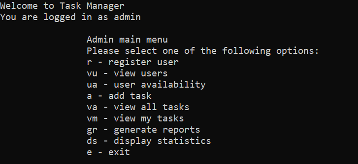
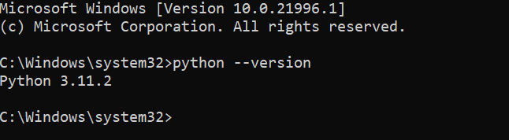

<!-- Heading -->
# <strong>Task Manager v2.0</strong>  
<a href="https://github.com/Mutnauq92/projects/tree/main/task_manager_v2.0" target="_blank">Task Manager v2.0</a>  

Task management program.
User can create, edit, assign and assess task assigned to assignees  
and create or view tasks statistics reports

<br><br><br>

<br><br><br>

# Table of contents

<!-- Ordered list  -->  
1. [Table of Contents](#dockerizing)
1. [Tools](#tools)  
1. [Resources](#resources)  
1. [Python Installation](#python-installation)<br>  
1. [Cloning Git Repository](#clone-repository)<br>  
1. [Usage](#usage)  
  
## <strong>Tools</strong>  
<a href="http://python.org" target="_blank">Python</a>  
<a href="https://docs.djangoproject.com/" target="_blank">Django</a>  
  
## Resources  
<a href="https://www.hyperiondev.com" target="_blank">Task Reading Material</a>  

## Python-Installation
Based on windows machine  
Download the latest <a href="https://www.python.org/downloads/" target="_blank">Python</a>  
and install on your local machine

Confirm python installation by opening cmd  
Then copy and run the command below
```
python --version
```

If python was installed correctly, the result will be displayed     
as in the image below. The version may differ depending on  
your installed version   




```
deactivate
```
<br>  
[top](#table-of-contents)  
<br>  

## <strong>Clone-Repository</strong>  

To clone the vintagecollection repo, you will need  
to download [<strong>GIT</strong>](https://git-scm.com/download/win), and select the version appropriate for your OS.    
Install git and run it.     
1. Open the folder you want to run the project from.
1. Right click and run cmd from there   
1. Copy and run the commands below, one at a time   
 to clone the repository and navigate to a folder containing    
 necessary files to run the project.

```
git clone https://github.com/Mutnauq92/task_manager
cd task_manager
```

Now, repository cloning is complete and the project is ready to run.    
Run the following command to change to directory where 'task_manager.py'  
is located and then run the program  
```  
cmd ['path/to/task_manager.py']
python task_manager.py
```

## <strong>Usage</strong>  
Administrative Login details  
**username**: admin  
**password**: admin  

<br>

# Dockerizing  

1. Create a <a href="https://hub.docker.com/signup">docker</a> account  
    if you already have one, <a href="https://hub.docker.com/login">login</a>
1. Open <a href="https://labs.play-with-docker.com/">Docker Play</a> online docker playground.  
    login and press <a href="https://www.google.com"><button style="height:30px;background:green">START</button></a>  

1. Click on '+ ADD NEW INSTANCE'  

1. Once in the terminal, enter command:
    ```
    docker pull mohapi007/task_manager
    ```  

1. Now type the following command and press enter  
to run interactive shell   
    ```
    docker run -it mohapi007/task_manager
    ```  
1. Use the same administrative credentials mentioned earlier.

<br>  

# Enjoy !!!
